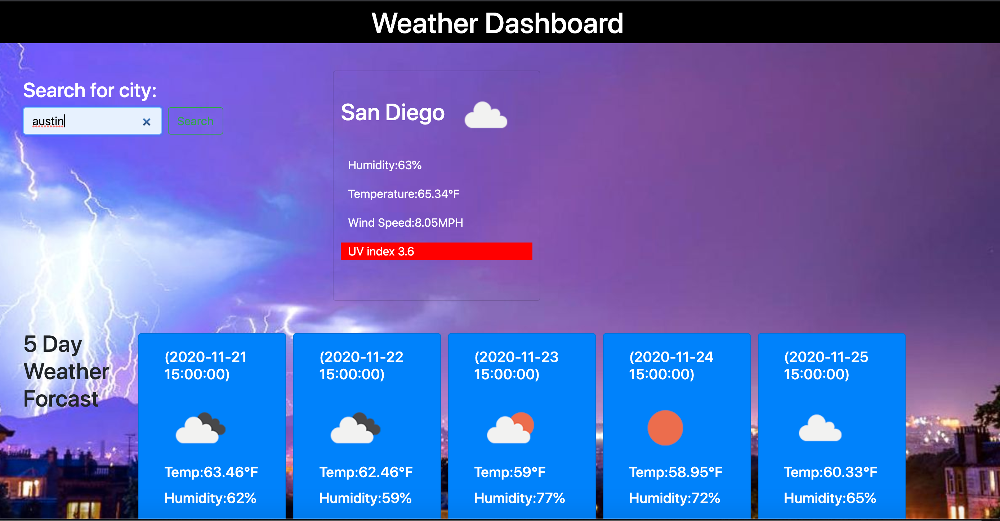

# Weather_Dashboard

## Description
Open weather map API provides current weather data, weather forecast data. With our application, we will make API calls by city name to the open weather map API using Ajax to get response in JSON format.
The weather app will be used to: Get current weather information like temperature, pressure, humidity, wind speed etc. Get weather forecast information of any city by city name . 
Features: Make API calls with Ajax. Open weather map API description. Get current weather information. Get weather forecast information. Use jquery plugin to animate text.

## Table of Contents 

* [Installation](#Installation)
* [User Story](#UserStory)
* [user Guide](#userGuide)
* [Technologies Used](#Technology)
* [Languages Used](#Languages)
* [Final Result](#FinalResult)
* [ResourceReffered](#ResourceReffered)
* [Github_Links](#Github_Links)

## Installation
To install this code, download the zip file, or use GitHub's guidelines to clone the repository., Links are provided below in resources.

## User Guide
Enter the city name you want to get weather information.You can click on search button or press Enter. You will be able to see today's weather and 5 day weather Forecast.
Now, when you are done and refresh the page, then also you will have the information of the weather of the last search city.(with local storage).

## Technologies Used
1.Bootstrap-CSS Framework 
2.Weather forecast Api 
3.Ajax
4.Local storage

## Languages used
1.Javascript 
2.HTML 
3.CSS

## UserStory
As a traveler 
I want to see the weather outlook for multiple cities 
So that I can plan a trip accordingly.

## Final Result
### ScreenShots
Current updated Weather and 5 day Weather Forecast.

## ResourceReffered
[For other things https://www.w3schools.com/  
[For concepts] https://stackoverflow.com/questions/3275164/javascript-quiz  
[GetBootstrap] (https://getbootstrap.com/) - Open-source CSS framework directed at responsive, mobile-first front-end web development. 
[OpenWeather API] (https://openweathermap.org/api) - OPEN API to retrieve weather data for cities. 
[Postman] (https://www.postman.com/) - The Postman API allows to easy access to API.

## Github_Links
[**URL of My Github Repository**](https://github.com/guptaria/Weather_Dashboard) 
[**URL of Deployed Application**](https://guptaria.github.io/Weather_Dashboard/)

